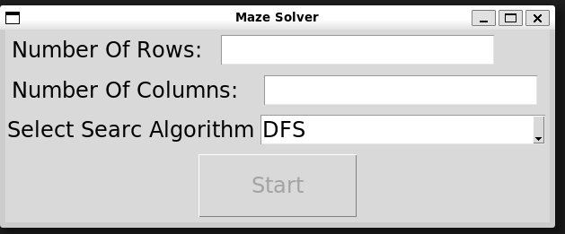
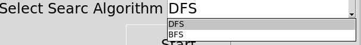
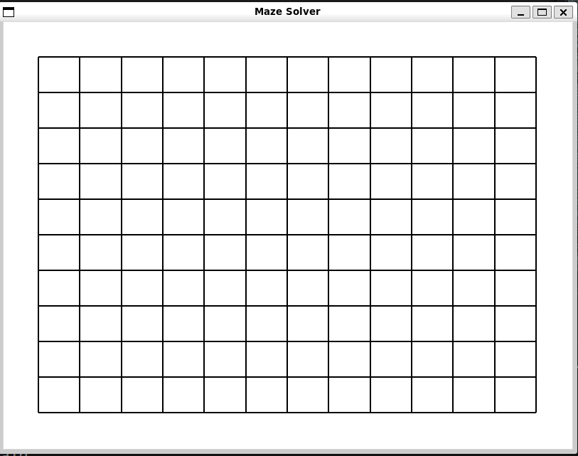
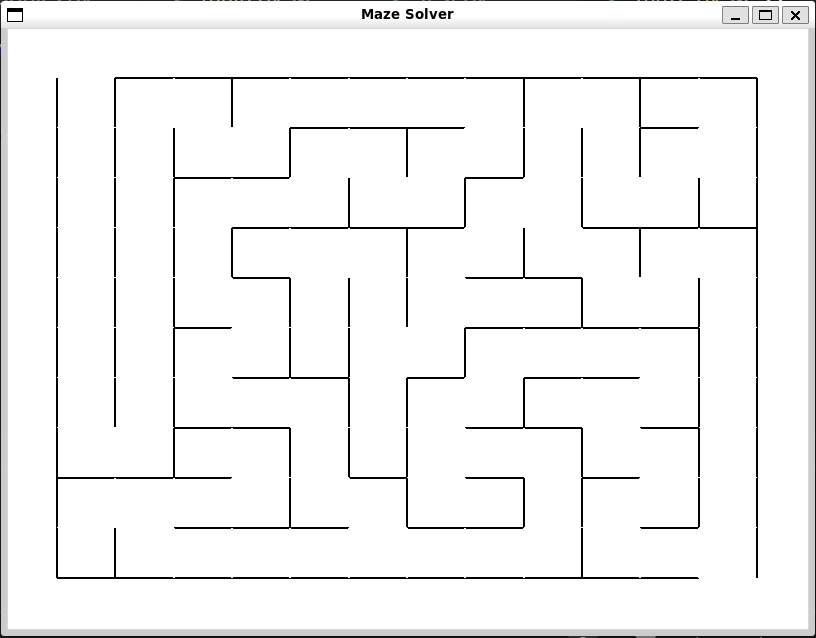
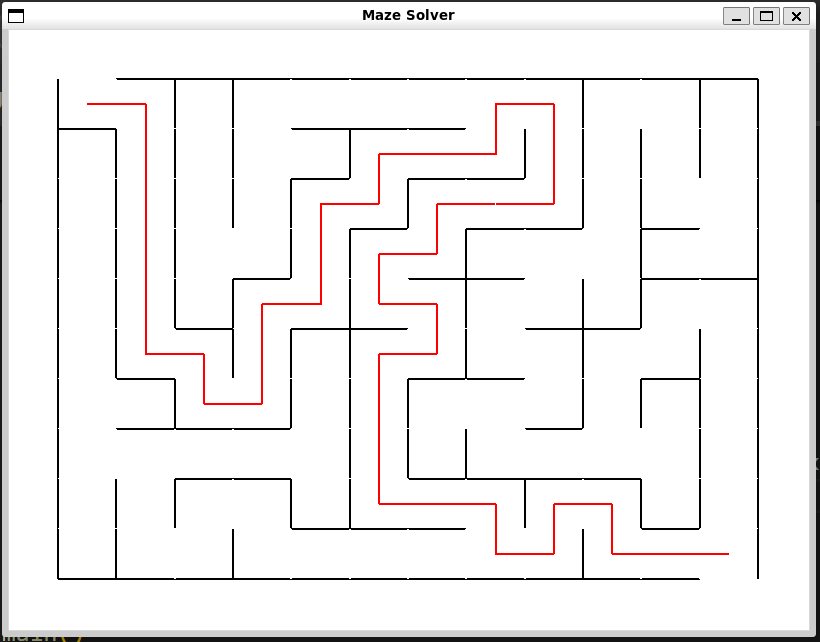
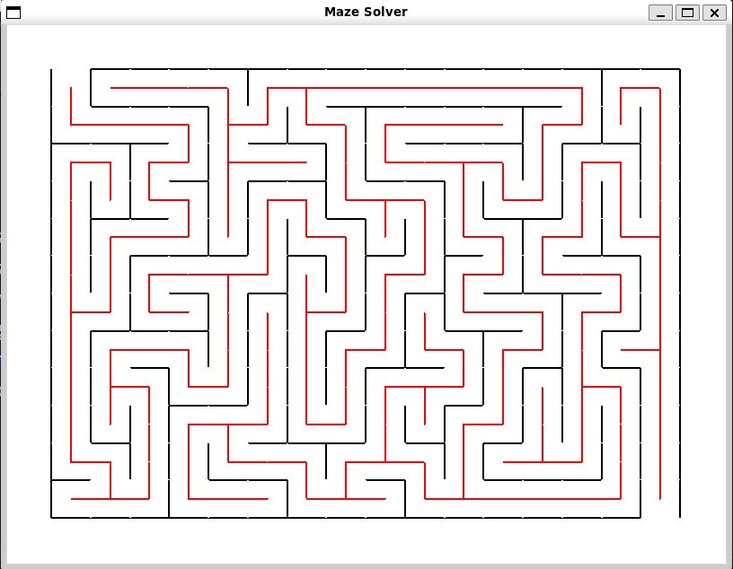

# Maze Solver

## Introduction

Maze solver app, is an illustration for *"**depth first search**"* and *"**breadth first search**"*, by solving a maze.

Application displays a maze in form of a matrix. Then app develops a maze by breaking walls between starting cell to exit cell in matrix. The maze displayed is different every time application is started.
Finally the application finds a path between start and exit cell using DFS or BFS.

## Application guide

To start the application use *"main.sh* file. When the bash file is executed, it displays a window.

Application takes user input for,
- Number of rows for maze
- Number of columns for maze
- Search algorithm (BFS or DFS)

*Note: If Number of rows, number of columns and search algorithm boxes are empty, **Start** button will not work*

For search algorithm , one can only select out of DFS and BFS

Once all values are entered and start button is clicked. A new window appears with a matrix having number of rows and columns added by user

The application develops maze using *'DFS'*, it starts breaking walls of cell randomly, to develop a random maze, every time the application is started

Now once the maze is ready, the application depending on the search algorithm selected, starts searching a way out from start to exit.

**Example for DFS**

**Example  for BFS**

